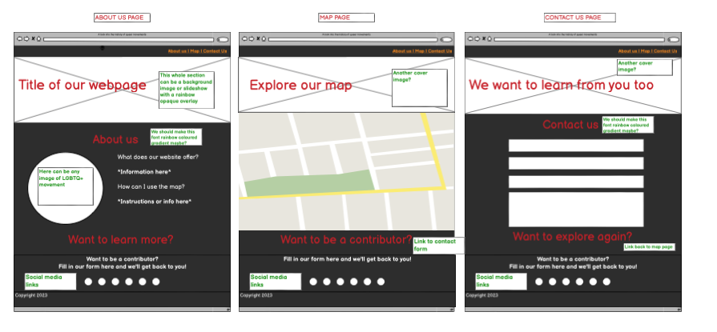
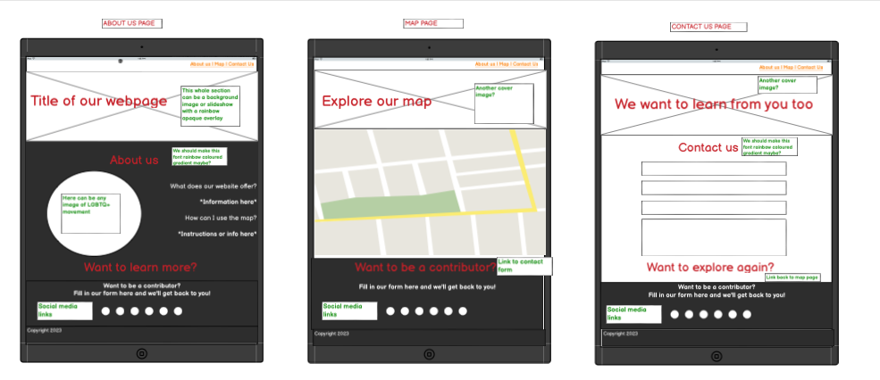
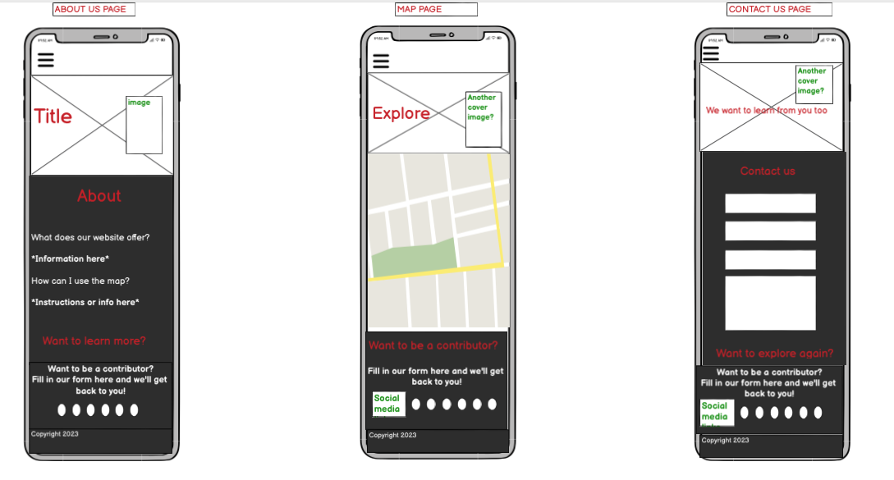

# Hackteam-6

# 🌈 Pride Representation 🥳

        

## Table of Content

1. [Criteria](#criteria)
2. [Intro](#intro)
3. [User Experience](#user-experience)
   1. [Project Goals](#project-goals)
   1. [Target Audience](#target-audience)
   1. [User Requirements and Expectations](#user-requirements-and-expectations)
   1. [User Stories](#user-stories)
   1. [Development Planes](#development-planes)
4. [Design](#design)
   1. [Colour Scheme](#colour-scheme)
   2. [Typography](#typography)
   3. [Imagery](#imagery)
5. [Features](#features)
   1. [Design Features](#design-features)
   2. [Existing Features](#existing-features)

## Criteria

In this section, we will briefly discuss how our team addressed the applicable criteria:

- ✨ What Framework was used?
- ✨ How innovative is the idea and project?
- ✨ Was the README Template used and expanded upon?
- ✨ Was the GitHub Project used to plan and execute the project?
- ✨ Is the project completed and deployed?

## Intro

_[TO DO]_
One or two paragraphs providing an overview of our project, including the theme - whether it is one of the 7 themes or our own team's theme.

## User Experience

### Project Goals

The primary goal of the project is to create an interactive website which allows users to find information about key events relating to the LGBTQ+ liberation movement in different countries. Additionally, the users are encouraged to submit suggestions of events they would like to be featured on the map.

### Target Audience

- People interested in Queer history;
- People who want to learn more about liberation movements across the world;
- People identifying as a part of the LGBTQ+ community;
- People wanting to become better allies.

### User Requirements and Expectations

- An intuitive navigation system;
- A way to find relevant information easily;
- Website functions to work as expected;
- A visually appealing design;
- Accessibility.
- An easy way to contact the site owners.

### User Stories

#### **First-time user**

1. As a new user, I want to identify the purpose of the website.
2. As a new user, I want to navigate the site intuitively and with ease.
3. As a new user, I want the instructions to be easily found, clear, and concise.
4. As a new user, I want the visual content to be attractive, appealing and relevant to the site content.
5. As a new user, I want to be able to easily find more information about the project.

#### **Returning user**

1. As a returning user, I want to be able to send information about events I think should be featured on the map to the site owners.
2. As a returning user, I want to be able to view the site on a range of different devices.
3. As a returning user, I want to be able to contact the site owners to suggest an update to the information featured on the site.

### Development Planes

In order to create an interactive website that allows the user to get useful information about the history of the Pride movement in different countries, the following planes are made.

[Back to top ⇧](#)

#### Strategy

Strategy incorporates user needs as well as product objectives. This website will focus on the following target audience, divided into three main categories:

- **Roles:**

  - New users
  - Current users

- **Demographic:**

  - All ages
  - ...

- **Psychographic:**
  - Lifestyles:
    - Interest in LGBTQ+ community
    - Interest in human rights
    - ...
  - Personality/Attitudes:
    - Open-minded
    - Respectful
    - Inclusive
    - ...

The website is supposed to enable the **user** to:

- select a country by moving and clicking the mouse.
- retrieve the information on the history of the Pride movement events in a particular country.
- get the information in a form of a short text about history and an image of the event.
- suggest a change or an update of the information on the site.

Taking all into consideration, the following strategy table shows the corrispondence of importance and viability.

Importance and Viability Table

#### Scope

The scope plane defines requirements based on the goals established on the strategy plane. So, accordingly , the identified required features are broken into the following categories:

- Content Requirements:
  - ## The user will be looking for:
    -
    - ...
- Functionality Requirements:
  - ## The user will be able to:
    - ...

#### Structure

The above mentioned information were organized in a site map, showing how users can navigate through the site with ease and efficiency:

Site Map

#### Skeleton and Wireframes

For this project, we used [Balsamiq](https://balsamiq.com/) in the initial design phase, before the coding process. This enabled us to develop the website's structure, skeleton, layout and overall look and style. We created designs for desktop, tablet and mobile screens to ensure that responsiveness was at the forefront of the application from the beginning.

Screenshots

_Desktop Wireframes_

_iPad Wireframes_

_Phone Wireframes_

[Back to top ⇧](#)

### Design,Layout and Structure

#### Colour Scheme

The default colour scheme was made by [Canva Color Palette Generator](https://www.canva.com/colors/color-palette-generator/).

Colour Palette

    

To that colour scheme, there was added Medium Turquoise colour (#38D2D2) for the buttons with 3d effect from the website [Beautiful CSS buttons examples](https://getcssscan.com/css-buttons-examples).
The same colour was used for the gradient effect on the navbar, with the help of [CSS Gradient](https://cssgradient.io/) web app.

#### Typography

Fonts used on the website are from the [Google Fonts](https://fonts.google.com/), namely **Carter One** and **Oxygen**. Carter One appears in the Logo, whilst Oxygen in the rest of the website.

#### Imagery

The images are taken from the different sources and are credited in the Credits of this file. The main sources were:

- [Pixabay](https://pixabay.com/) for the front face of the cards,
- [Unsplash](https://unsplash.com/) for the image for 404 page.
- [The Pattern Library](http://thepatternlibrary.com/) for the background images.

## Features

### Design Features

Each page within the site has a consistent and responsive navigation system. The details of features on the site are detailed below.

- The **Header** with the **Navigation Bar** is positioned at the top of the page.
- The **Footer** stays at the bottom of the screen at all times, on all screen sizes, except when the height of the screen is too small for the cards field. All social media links on the footer open in a new tab. They are Instagram, GitHub and Facebook pages of the _[SCRUM Master]_. The copyright info quotes _[COPYRIGHT INFO]_ . --> _X or we could add the GitHub links of the whole team??? X_

### Existing Features

- **Navigation Bar** - Appears on every page for a consistently easy and intuitive navigable system, except of the 404 page.
- **Social Media Icons** - Appearing on every page, the icons are appropriate representations of the Social Media platforms, linking users to the developers Instagram, GitHub and Facebook accounts. The icons appear in the centre of the footer.
- **[Home Page](# "HOMEPAGE NAME")** - Main Page that gives the feature of retrieving the info about the Pride Events History.
- **[About Page](# "ABOUT PAGE")** - The page which brings the information about the creating team.
- **[404 Page](# "404 PAGE")** - 404 error page Pride Themed .
- **How to navigate** - A modal window brings the indications for the game and its functionalities.

### Features to Implement in the future

- ...

[Back to top ⇧](#)

The goal section provides a concise summary of the main objective or purpose of the project or software described in this README. It addresses the following aspects:

- ➡️ Problem Statement
- ➡️ Objective(s)
- ➡️ Target Audience
- ➡️ Benefits

## Technologies Used

### Main Languages Used

- [HTML](https://developer.mozilla.org/en-US/docs/Web/HTML): The standard markup language for creating web pages.
- [CSS](https://developer.mozilla.org/en-US/docs/Web/CSS): Cascading Style Sheets used for styling the user interface. For more information, refer to the [CSS documentation](https://developer.mozilla.org/en-US/docs/Web/CSS).
- [JavaScript](https://developer.mozilla.org/en-US/docs/Web/JavaScript): A programming language used for client-side scripting and frontend development.
- [Python](https://www.python.org/): A versatile programming language used for backend development.

### Frameworks, Libraries and Programs Used

- [Tailwind CSS](https://tailwindcss.com/): A utility-first CSS framework for rapid UI development. For more information, refer to the [Tailwind CSS documentation](https://tailwindcss.com/docs).
- [REST API](https://restfulapi.net/): A set of architectural principles for building web services.
- [Flask](https://flask.palletsprojects.com/): A lightweight web framework written in Python for building web applications.

- [Canva Color Palette Generator](https://www.canva.com/colors/color-palette-generator/)
  - Canva Color Palette Generator was used to make the initial colour palette.
- [CSS Gradient](https://cssgradient.io/)
- CSS Gradient web app was used to make gradient colour backgrounds.
- [Google Fonts](https://fonts.google.com/ "Link to Google Fonts")
  - Google fonts was used to import the fonts "xxx", into the style.css file. These fonts were used throughout the project.
- [Font Awesome](https://fontawesome.com/ "Link to FontAwesome")
  - Font Awesome was used on almost all pages throughout the website to import icons (e.g. social media icons) for UX purposes.
- [GitPod](https://gitpod.io/ "Link to GitPod homepage")
  - GitPod was used for writing code, committing, and then pushing to GitHub.
- [GitHub](https://github.com/ "Link to GitHub")
  - GitHub was used to store the project after pushing
- [Balsamiq](https://balsamiq.com/ "Link to Balsamiq homepage")
  - Balsamiq was used to create the wireframes during the design phase of the project.
- [Am I Responsive?](https://amiresponsive.co.uk/ "Link to Am I Responsive Homepage")

  - Am I Responsive was used to test responsivenes and generate design for the mockup imagery used at the beginning of this documentation.

- [Peek](https://github.com/phw/peek)
  - Peek was used to make screencasts for the documentation.

[Back to top ⇧](#)

## Testing

### Testing User Stories

#### New User Goals:

#### Current User Goals:

## Manual Testing

### Common Elements Testing

Manual testing was conducted on the following elements that appear on every page:

- Clicking on the Navigation Bar's links will bring the user to the specified page.

Navbar links

- Hovering over the Navigation bar elements will trigger the `hover` effect, highlighting the link for the user.

Navbar hover effect

     
 
- Clicking on the Social Media links will open a new tab

- Instagram

Instagram Social Media link

- GitHub

GitHub Social Media link

- Facebook

Facebook Social Media link

[Back to top ⇧](#)

### Home Page

Manual testing was conducted on the following elements of the [Home Page](#):

#### World Map

- Hovering over the world map shows the country that is positioned under the mouse. By clicking on the chosen country, the modal appears with the information of the Pride event in that country. The map can be zoomed in or out.

World Map hover and zoom

- By clicking on the chosen country on the world map, the modal appears with the information about the Pride event in said country. Modal is closed on clicking the "OK" button.

World Map click

...

### Responsiveness

Manual testing was conducted on all three site pages for responsiveness:

- Responsiveness of Home Page.

Resposiveness - Home Page

     
- Responsiveness of About Page.

Resposiveness - Main World Map Page

...

- Responsiveness of 404 Page.

Resposiveness - 404 Page

[Back to top ⇧](#)

## Automated Testing

### Code Validation

The [W3C Markup Validator](https://validator.w3.org/) service was used to validate the `HTML` and `CSS` code used. The [JSHint JavaScript Code Quality Tool](https://jshint.com/) was also used to validate the sites `JS` code.

**Results:**

- Home Page

Home Page HTML Validation

- Main World Map Page

Main World Map Page HTML Validation

- ...

- 404 Page

404 Page HTML Validation Results

- CSS Stylesheet

Style Sheet Validation

- JavaScript

JavaScript Validation

- Python

Python Validation

### Browser Validation -> IF NECESSARY

- Google Chrome

Google Chrome Validation 

- ...

[Back to top ⇧](#)

### Lighthouse Validation

- Home Page Lighthouse Validation

Home Page Lighthouse Validation

-

- Main World Map Page Lighthouse Validation

Main World Map Lighthouse Validation

- 404 Page Lighthouse Validation

404 Page Lighthouse Validation

[Back to top ⇧](#)

## Credits

We would like to give credit to the following individuals, organizations, and resources that have contributed to the project or provided inspiration:

- 🙌 [Contributor 1]
- 🙌 [Contributor 2]
- 🌐 [External Resource 1]
- 🌐 [External Resource 2]
