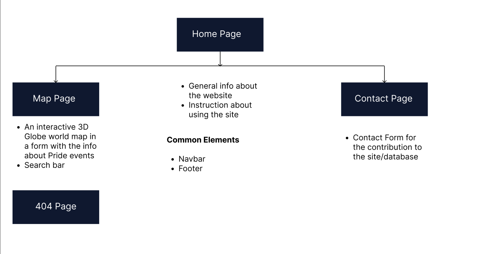
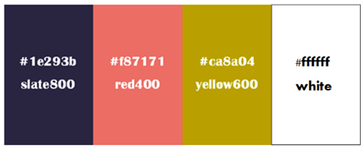

# Rainbow Mappers

# Out and About: Interactive World Map of Pride Events

[Live link](https://vanderpatrick.github.io/Hackteam-6/)

# 🌈 Pride Representation 🥳

        

## Table of Content

1. [Criteria](#criteria)
2. [Intro](#intro)
3. [User Experience](#user-experience)
   1. [Project Goals](#project-goals)
   2. [Target Audience](#target-audience)
   3. [User Requirements and Expectations](#user-requirements-and-expectations)
   4. [User Stories](#user-stories)
   5. [Development Planes](#development-planes)
4. [Design](#design)
   1. [Colour Scheme](#colour-scheme)
   2. [Typography](#typography)
   3. [Imagery](#imagery)
5. [Features](#features)
   1. [Design Features](#design-features)
   2. [Existing Features](#existing-features)
   3. [Features To Implement In The Future](#features-to-implement-in-the-future)
6. [Technologies Used](#technologies-used)
   1. [Main Languages Used](#main-languages-used)
   2. [Frameworks, Libraries, and Programs Used](#frameworks-libraries-and-programs-used)
7. [Testing](#testing)
   1. [Testing User Stories](#testing-user-stories)
   2. [Manual Testing](#manual-testing)
   3. [Responsiveness](#responsiveness)
   4. [Automated Testing](#automated-testing)
8. [Credits](#credits)

## Criteria

In this section, we will briefly discuss how our team addressed the applicable criteria:

- ✨ What Framework was used?
- ✨ How innovative is the idea and project?
- ✨ Was the README Template used and expanded upon?
- ✨ Was the GitHub Project used to plan and execute the project?
- ✨ Is the project completed and deployed?

## Intro

Out and About is an exciting project that aims to create an interactive world map showcasing Pride events happening across different countries. This Full Stack project focuses on promoting inclusivity, diversity, and the celebration of LGBTQ+ communities worldwide.
With the Out and About platform, users will have the opportunity to explore a dynamic map that highlights some important Pride events. By clicking on specific countries, users can access some general information about each event, including dates, locations, and event descriptions or can contribute to the project by sending updated or missing information. Out and About aims to serve as a comprehensive resource for the LGBTQ+ community and allies, fostering a sense of unity and awareness about Pride celebrations worldwide.

## User Experience

### Project Goals

The primary goal of the project is to create an interactive website which allows users to find information about key events relating to the LGBTQ+ liberation movement in different countries. Additionally, the users are encouraged to submit suggestions of events they would like to be featured on the map.

### Target Audience

- People interested in Queer history;
- People who want to learn more about liberation movements across the world;
- People identifying as a part of the LGBTQ+ community;
- People wanting to become better allies.

### User Requirements and Expectations

- An intuitive navigation system;
- A way to find relevant information easily;
- Website functions to work as expected;
- A visually appealing design;
- Accessibility.
- An easy way to contact the site owners.

### User Stories

#### **First-time user**

1. As a new user, I want to identify the purpose of the website.
2. As a new user, I want to navigate the site intuitively and with ease.
3. As a new user, I want the instructions to be easily found, clear, and concise.
4. As a new user, I want the visual content to be attractive, appealing and relevant to the site content.
5. As a new user, I want to be able to easily find more information about the project.

#### **Returning user**

1. As a returning user, I want to be able to send information about events I think should be featured on the map to the site owners.
2. As a returning user, I want to be able to view the site on a range of different devices.
3. As a returning user, I want to be able to contact the site owners to suggest an update to the information featured on the site.

### Development Planes

In order to create an interactive website that allows the user to get useful information about the history of the Pride events in different countries, the following planes are made.

[Back to top ⇧](#)

#### Strategy

Strategy incorporates user needs as well as product objectives. This website will focus on the following target audience, divided into three main categories:

- **Roles:**

  - New users
  - Returning users

- **Demographic:**

  - All ages

- **Psychographic:**

  - Lifestyles:

    - Interest in LGBTQ+ community
    - Interest in human rights
    - Interest in traveling and knowing about the LBTQ+ events of the country they visit

  - Personality/Attitudes:
    - Open-minded
    - Respectful
    - Inclusive
    - Supportive of diversity

The website is supposed to enable the **user** to:

- select a country by moving and clicking the mouse.
- retrieve the information on the history of the Pride movement events in a particular country.
- get the information in a form of a short text about history and an image of the event.
- suggest a change or an update of the information on the site.

#### Scope

The scope plane defines requirements based on the goals established on the strategy plane. So, accordingly, the identified required features are broken into the following categories:

- Content Requirements:
  - ## The user will be looking for:
    - the information about some significant Pride event in particular country.
    - the information about the interaction on the Map Page.
    - the form by which they will be able to contribute to the info on the site.
- Functionality Requirements:
  - ## The user will be able to:
    - easily navigate through the pages wether they want to know more about the site, use the world map interactively to retrieve the info, or send the contributing information.
    - hover over the world map and select the country about which they want to retrieve the info about Pride.
    - send the information about the Pride events that aren't presented on the world map or update the existing ones by contact form.

#### Structure

The above mentioned information were organized in a site map, showing how users can navigate through the site with ease and efficiency:

Site Map

#### Skeleton and Wireframes

For this project, we used [Balsamiq](https://balsamiq.com/) in the initial design phase, before the coding process. This enabled us to develop the website's structure, skeleton, layout and overall look and style. We created designs for desktop, tablet and mobile screens to ensure that responsiveness was at the forefront of the application from the beginning.

Screenshots

_Desktop Wireframes_

_iPad Wireframes_

_Phone Wireframes_

[Back to top ⇧](#)

### Design,Layout and Structure

#### Colour Scheme

The default colour scheme was made by [Canva Color Palette Generator](https://www.canva.com/colors/color-palette-generator/).
The colours were selected from existing Tailwind CSS classes. They were chosen as they correspond nicely with the hero image.

Colour Palette

    

To that colour scheme, there was added Medium Turquoise colour (#38D2D2) for the buttons with 3d effect from the website [Beautiful CSS buttons examples](https://getcssscan.com/css-buttons-examples).
The same colour was used for the gradient effect on the navbar, with the help of [CSS Gradient](https://cssgradient.io/) web app.

#### Typography

Fonts used on the website are from the [Google Fonts](https://fonts.google.com/), namely **Carter One** and **Oxygen**. Carter One appears in the Logo, whilst Oxygen in the rest of the website.

#### Imagery

The images are taken from the different sources and are credited in the Credits of this file. The main sources were:

- [Pixabay](https://pixabay.com/) for the front face of the cards,
- [Unsplash](https://unsplash.com/) for the image for 404 page.
- [The Pattern Library](http://thepatternlibrary.com/) for the background images.

## Features

### Design Features

Each page within the site has a consistent and responsive navigation system. The details of features on the site are detailed below.

- The **Header** with the **Navigation Bar** is positioned at the top of the page.
- The **Footer** stays at the bottom of the screen at all times, on all screen sizes. All social media links on the footer open in a new tab. They are Facebook, Twitter and GitHub pages. The copyright info quotes **© 2023 Team Out and About**.

### Existing Features

- **Navigation Bar** - Appears on every page for a consistently easy and intuitive navigable system, except of the 404 page.
- **Social Media Icons** - Appearing on every page, the icons are appropriate representations of the Social Media platforms, linking users to the developers Instagram, GitHub and Facebook accounts. The icons appear in the centre of the footer.
- **[Home Page](# "PAGE")** - It is in fact the About page that contains the description of the page and instructions for the Map page features.
- **[Map Page](# "MAP")** - An interactive page containing the world map on which the user can find the information about the significant Pride Events by hovering and clicking on a desired country.
- **[Contact Page](# "CONTACT")** - The page on which there's a form for a user to fill in if wanting to contribute with an update or addition to the map information.
- **[404 Page](# "404 PAGE")** - 404 error page Pride Themed .

### Features to Implement in the future

- ...

[Back to top ⇧](#)

The goal section provides a concise summary of the main objective or purpose of the project or software described in this README. It addresses the following aspects:

- ➡️ Problem Statement
- ➡️ Objective(s)
- ➡️ Target Audience
- ➡️ Benefits

## Technologies Used

### Main Languages Used

- [HTML](https://developer.mozilla.org/en-US/docs/Web/HTML "Link to HTML Docs home page")
  - The HyperText Markup Language stands for the standard markup language for creating web pages.
- [CSS](https://developer.mozilla.org/en-US/docs/Web/CSS "Link to CSS Docs home page")
  - Cascading Style Sheets used for styling the user interface.
- [JavaScript](https://developer.mozilla.org/en-US/docs/Web/JavaScript "Link to JavaScript Docs home page")
  - A programming language used for client-side scripting and frontend development.
- [Python](https://www.python.org/ "Link to Python home page")
  - A versatile programming language used for backend development.

### Frameworks, Libraries and Programs Used

- [Tailwind CSS](https://tailwindcss.com/ "Link to Tailwind CSS home page")
  - A utility-first CSS framework for rapid UI development.
- [REST API](https://restfulapi.net/ "Link to REST API homepage")
  - A set of architectural principles for building web services.
- [Flask](https://flask.palletsprojects.com/ "Link to Flask home page")
  - A lightweight web framework written in Python for building web applications.
- [Mapbox API](https://www.mapbox.com/ "Link to Mapbox API homp page")
  - An open-source mapping platform for custom-designed maps and location-based applications.
- [Render.com](https://render.com/ "Link to Render home page")
  - A cloud platform for deploying and scaling web applications.
- [PostgreSQL](https://www.postgresql.org/ "Link to PostgreSQL home page")
  - An open-source relational database management system.
- [Flowbite](https://flowbite.com/docs/getting-started/quickstart/ "Link to Flowbite homepage")
  - Flowbite was used to create a dropdown button in the navigation bar.
- [Canva Color Palette Generator](https://www.canva.com/colors/color-palette-generator/ "Link to Canva home page")
  - Canva Color Palette Generator was used to make the initial colour palette.
- [CSS Gradient](https://cssgradient.io/)
  - CSS Gradient web app was used to make gradient colour backgrounds.
- [Google Fonts](https://fonts.google.com/ "Link to Google Fonts")
  - Google fonts was used to import the fonts "xxx", into the style.css file. These fonts were used throughout the project.
- [Font Awesome](https://fontawesome.com/ "Link to FontAwesome")
  - Font Awesome was used on almost all pages throughout the website to import icons (e.g. social media icons) for UX purposes.
- [GitPod](https://gitpod.io/ "Link to GitPod homepage")
  - GitPod was used for writing code, committing, and then pushing to GitHub.
- [GitHub](https://github.com/ "Link to GitHub") - GitHub was used to store the project after pushing
- [Balsamiq](https://balsamiq.com/ "Link to Balsamiq homepage")
  - Balsamiq was used to create the wireframes during the design phase of the project.
- [Am I Responsive?](https://amiresponsive.co.uk/ "Link to Am I Responsive Homepage")

  - Am I Responsive was used to test responsivenes and generate design for the mockup imagery used at the beginning of this documentation.

- [Peek](https://github.com/phw/peek)
  - Peek was used to make screencasts for the documentation.

[Back to top ⇧](#)

## Testing

### Testing User Stories

#### New User Goals:

#### Current User Goals:

### Manual Testing

#### Common Elements Testing

Manual testing was conducted on the following elements that appear on every page:

- Clicking on the Navigation Bar's links will bring the user to the specified page.

Navbar links

- Hovering over the Navigation bar elements will trigger the `hover` effect, highlighting the link for the user.

Navbar hover effect

     
 
- Clicking on the Social Media links will open a new tab

- Facebook

Facebook Social Media link

- Twitter

Twitter Social Media link

- GitHub

GitHub Social Media link

[Back to top ⇧](#)

#### Home Page

- Manual testing was conducted on the elements of the [Home Page](#).

Home Page

#### Map Page

- Hovering over the world map shows the country that is positioned under the mouse. By clicking on the chosen country, the modal appears with the information of the Pride event in that country. The map can be zoomed in or out.

Map hover and zoom

- By clicking on the chosen country on the world map, the modal appears with the information about the Pride event in said country. Modal is closed on clicking the "OK" button.

Map click

#### Contact Page

- Manual testing was conducted on the Contact Page [Contact Page](#).
  ...

### Responsiveness

Manual testing was conducted on all three site pages for responsiveness:

- Responsiveness of Home Page.

Resposiveness - Home Page

     
- Responsiveness of Map Page.

Resposiveness - Contact Page

- Responsiveness of Contact Page.

Resposiveness - Contact

- Responsiveness of 404 Page.

Resposiveness - 404 Page

[Back to top ⇧](#)

### Automated Testing

#### Code Validation

The [W3C Markup Validator](https://validator.w3.org/) service was used to validate the `HTML` and `CSS` code used. The [JSHint JavaScript Code Quality Tool](https://jshint.com/) was also used to validate the sites `JS` code. Python validation was made by the Code Institute [CI Python Linter](https://pep8ci.herokuapp.com/) validation web app.

**Results:**

- Home Page

Home Page HTML Validation

- Map Page

Map Page HTML Validation

- Contact Page

Contact Page HTML Validation

- 404 Page

404 Page HTML Validation Results

 

- CSS Stylesheet

Style Sheet Validation

 

- JavaScript

JavaScript Validation

 

- Python

Python Validation

#### Browser Validation

- Google Chrome

Google Chrome Validation 

- ...

[Back to top ⇧](#)

#### Lighthouse Validation

- Home Page

Home Page Lighthouse Validation

- Map Page

Map Page Lighthouse Validation

- Contact Page

Contact Page Lighthouse Validation

- 404 Page

404 Page Lighthouse Validation

[Back to top ⇧](#)

## Credits

We would like to give credit to the following individuals, organizations, and resources that have contributed to the project or provided inspiration:

- 🙌 [Contributor 1]
- 🙌 [Contributor 2]
- 🌐 [External Resource 1]
- 🌐 [External Resource 2]
